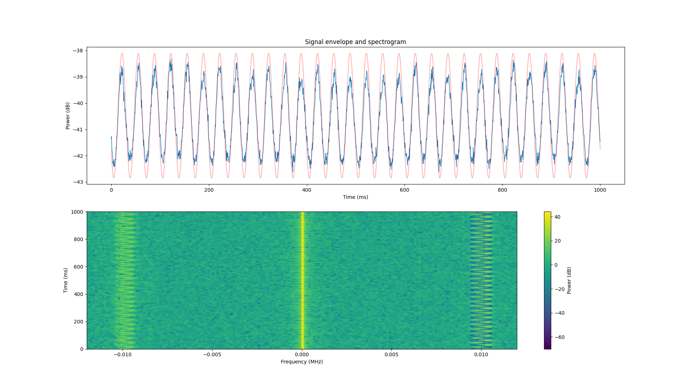

# vor-receiver

This project parses an IQ file recorded from a VOR beacon, and returns a
calculated magnetic heading by calculating the phase offset between the
AM and FM components of the signal.

